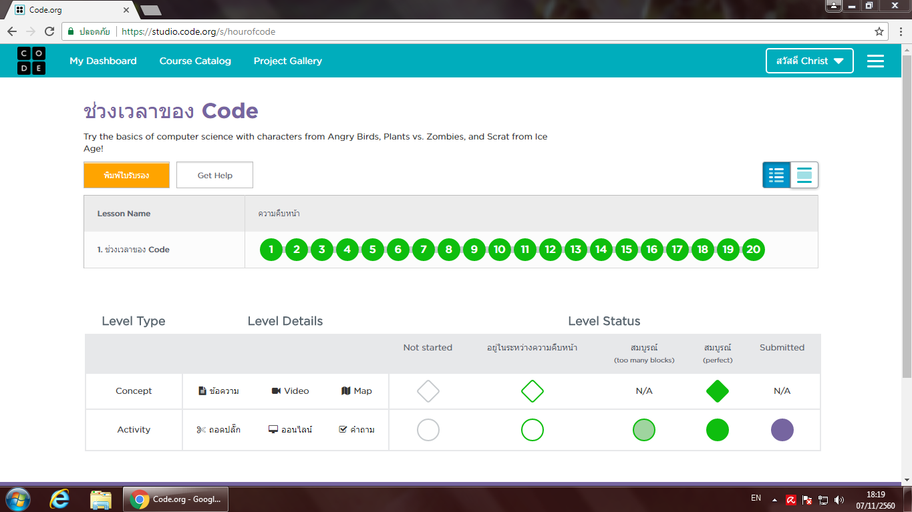
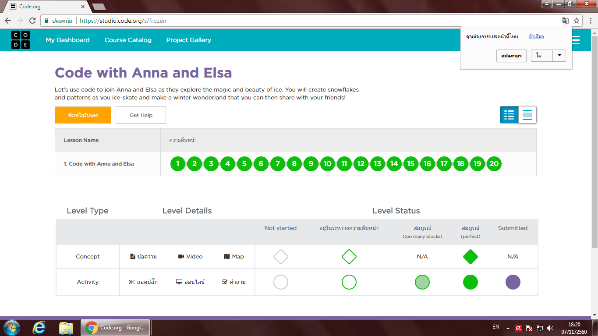
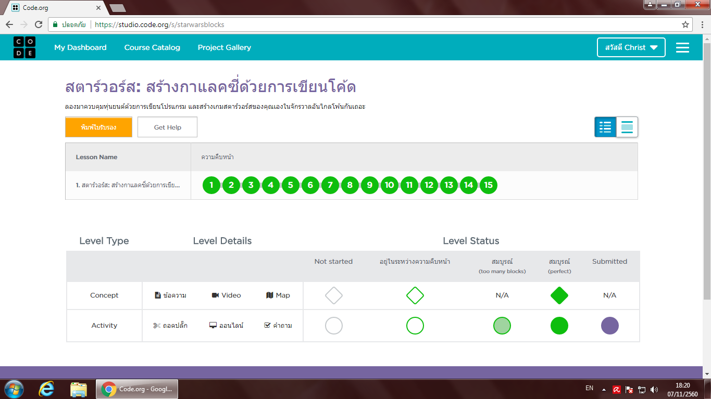
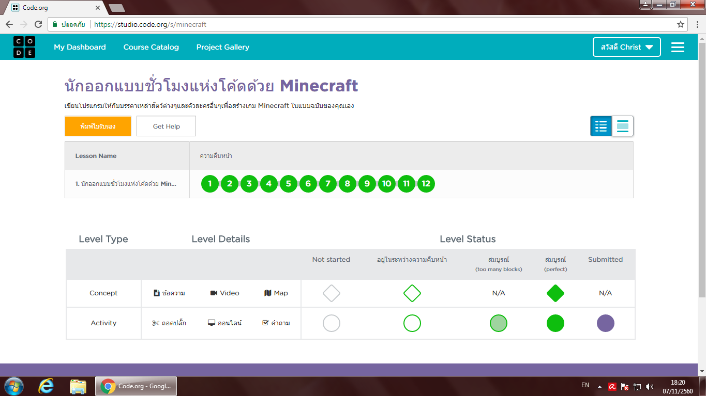

# tp_prog_week3
งานครั้งที่ 4 วิชาการเขียนโปรแกรมคอมพิวเตอร์ ปวส1

## วิธีการส่งงาน

1.  บันทึกหน้า dashboard ของแต่ละกิจกรรม
2.  **ตั้งชื่อตามนี้**
    -  Angry Bird เป็น lab1.png
    -  Frozen เป็น lab2.png
    -  Star wars เป็น lab3.png
    -  Minecraft เป็น lab4.png
3.  อัพทั้ง 4 รูปไว้ใน folder img (เมื่อสำเร็จไฟล์จะมีภาพปรากฎ)
4.  เขียนสรุปสิ่งที่ได้ด้วย

------------------------------------------

## กิจกรรมทดลอง Angry bird

### ภาพยืนยันความสมบูรณ์ (3 points)

### สรุปสิ่งที่ได้เรียนรู้จากกิจกรรม (2 points)

    เกมส์แองกี้เบิร์ด ทำให้เราได้คิดในการใช้คำสั่งต่างๆในการที่จะผ่านด่านแต่ละด่าน ซึ่งแต่ละด่านจะมีความยาก และความซับซน ทำให้เรารู้ถึงทักษะในการแก้ไขปัญหาเพื่อผ่านด่านแต่ละด่านไปได้ ในการเรียนรู้ถึงคำสั่งแต่ละคำสั่ง ลองผิดลองถูก ว่าแต่ละคำสั่งทำงานอย่างไร ในด่านแรกซึ่งยังไม่ค่อยเข้าใจในวิธีการเล่น จึงทำให้เกิดการซับซนและมีความเข้าใจช้า ทำให้เสร็จคนหลังๆของห้อง 
- ได้รู้ถึงทักษะการเล่นเกมส์ในแบบใหม่ๆ
- ได้รู้ถึงการใช้โปรแกรมใหม่ๆ
- ได้รู้ถึงการแก้ปัญหาในการเล่นเกมส์
- ได้รู้ถึงคำศัพท์ภาษาอังกฤษในคำสั่งเพิ่มมากขึ้น
- ได้รู้ถึงการใช้คำสั่งใหม่ๆ 
- ได้รู้ว่าคำสั่งต่างๆใช้งานอย่างไร
- ได้ทดลองผิด ทดลองถูก ในการที่จะผ่านด้านต่อไป

-------------------------------------------

## กิจกรรมทดลอง Frozen

### ภาพยืนยันความสมบูรณ์ (3 points)

### สรุปสิ่งที่ได้เรียนรู้จากกิจกรรม (2 points)

    เกมส์เอลซ่า เป็นด่านที่คิดว่าตัวเข้าใจที่สุด และสามารถทำได้ด้วยตัวเองทั้งหมด ซึ่งความซับซ้อนในเกมส์ ต้องใช้ทักษะในการแก้ปัญหาในแต่ละด่าน ได้รู้ถึงการใช้คำสั่งใหม่ๆ และ การสังเกตุและฝึกฝนทางการคิดที่จะแก้ไขปัญหาในแต่ละด่าน ทำให้มีการทดลองเล่นและลองผิดลองถูกในการใช้คำสั่งต่างๆ ซึ่งจำทำให้สามารถผ่านด่านแต่ละด่านไปได้ในที่สุด
- ได้รู้ถึงทักษะการเล่นเกมส์ในแบบใหม่ๆ
- ได้รู้ถึงการใช้โปรแกรมใหม่ๆ
- ได้รู้ถึงการแก้ปัญหาในการเล่นเกมส์
- ได้รู้ถึงคำศัพท์ภาษาอังกฤษในคำสั่งเพิ่มมากขึ้น
- ได้รู้ถึงการใช้คำสั่งใหม่ๆ 
- ได้รู้ว่าคำสั่งต่างๆใช้งานอย่างไร
- ได้ทดลองผิด ทดลองถูก ในการที่จะผ่านด้านต่อไป

------------------------------------------

## กิจกรรมทดลอง Star wars

### ภาพยืนยันความสมบูรณ์ (3 points)

### สรุปสิ่งที่ได้เรียนรู้จากกิจกรรม (2 points)

    เกมส์หุ่นยนต์ เป็นด่านที่ง่ายในช่วงแรกๆ แต่พอหลังๆเริ่มมีคำสั่งใหม่ๆเข้ามาใช้ในการเล่นเกมส์ทำให้เกิดความยาก และต้องรู้ว่าโจทย์ให้ทำอะไร เราจะหยิบคำสั่งใดมาใช้ในการเล่นเกมส์ เราจะต้องมีทักษะในการอ่านภาษาอังกฤษหรือจะแปลเป็นภาษาไทยก็ได้แล้วแต่ความถนัด และต้องมีทักษะการแก้ไขในแต่ละด่านให้ผ่านไปได้ในที่สุด
- ได้รู้ถึงทักษะการเล่นเกมส์ในแบบใหม่ๆ
- ได้รู้ถึงการใช้โปรแกรมใหม่ๆ
- ได้รู้ถึงการแก้ปัญหาในการเล่นเกมส์
- ได้รู้ถึงคำศัพท์ภาษาอังกฤษในคำสั่งเพิ่มมากขึ้น
- ได้รู้ถึงการใช้คำสั่งใหม่ๆ 
- ได้รู้ว่าคำสั่งต่างๆใช้งานอย่างไร
- ได้ทดลองผิด ทดลองถูก ในการที่จะผ่านด้านต่อไป

-------------------------------------------

## กิจกรรมทดลอง Minecraft

### ภาพยืนยันความสมบูรณ์ (3 points)

### สรุปสิ่งที่ได้เรียนรู้จากกิจกรรม (2 points)

    เกมส์เก็บฟาง เก็บนมวัว ซึ่งเกมส์นี้จะเป็นด่านที่มีคำสั่งมากที่สุด จะมีความยากและความซับซ้อน เราจะต้องมีทักษะการทดลองว่าคำสั่งไหนใช้งานอย่างไร ลองผิดลองถูกและทดลองทำ จนสามารถผ่านด่านแต่ละด่านไปได้ เราๆได้รู้ถึงการแก้ปัญหาในการเล่นเกมส์ และรู้จักคำสั่งใหม่ๆมากขึ้น
- ได้รู้ถึงทักษะการเล่นเกมส์ในแบบใหม่ๆ
- ได้รู้ถึงการใช้โปรแกรมใหม่ๆ
- ได้รู้ถึงการแก้ปัญหาในการเล่นเกมส์
- ได้รู้ถึงคำศัพท์ภาษาอังกฤษในคำสั่งเพิ่มมากขึ้น
- ได้รู้ถึงการใช้คำสั่งใหม่ๆ 
- ได้รู้ว่าคำสั่งต่างๆใช้งานอย่างไร
- ได้ทดลองผิด ทดลองถูก ในการที่จะผ่านด้านต่อไป

-------------------------------------------

## สรุปคะแนน

| Topic          | Score           |
| :------------- | :-------------: |
| Angry Bird 1   |                 |
| Angry Bird 2   |                 |
| Frozen 1       |                 |
| Frozen 2       |                 |
| Star wars 1    |                 |
| Star wars 2    |                 |
| Minecraft 1    |                 |
| Minecraft 2    |                 |

**รวม :** 0 คะแนน
